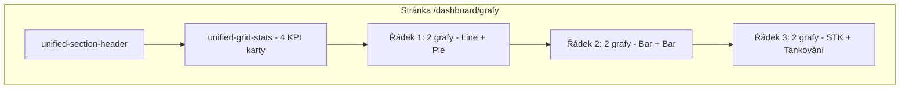

# Plán: Stránka Analýzy a Grafů `/dashboard/grafy`

## 1. Shrnutí současného stavu

**Existující implementace:** Stránka [src/app/dashboard/grafy/page.tsx](src/app/dashboard/grafy/page.tsx) je **Client Component**, která:

- Načítá data z `/api/auta` a `/api/transakce` (celé kolekce)
- Zobrazuje Pie chart stavu vozidel (aktivní/servis/vyřazeno)
- Zobrazuje Bar chart transakcí (bez rozdělení příjmy/výdaje)
- STK přehled je pouze placeholder
- **Nesplňuje** UNIFIED_DESIGN_GUIDE (chybí unified-section-header, unified-card, unified-grid-stats)

**Dostupné datové modely** z [prisma/schema.prisma](prisma/schema.prisma):

- **Transakce**: `castka`, `datum`, `typ` (příjem/výdaj), `kategorieId`, `autoId`, `status` (PENDING/APPROVED/REJECTED/CANCELLED)
- **Auto**: `stav` (aktivní/servis/vyřazeno), `najezd`, `rokVyroby`, `datumSTK`
- **Udrzba**: `cena`, `datumUdrzby`, `typUdrzby`, `status` (COMPLETED, PENDING, ...)
- **Tankovani**: `litry`, `cena`, `datum`
- **Oprava**: `cena`, `datum`, `kategorie`
- **SmenaRidic**: `ridicEmail`, `datum`, `casPrichodu`, `casOdjezdu`, `cisloTrasy`

---

## 2. Top 4 KPI karty


| #   | KPI                         | Popis                                                                               | Zdroj dat                          |
| --- | --------------------------- | ----------------------------------------------------------------------------------- | ---------------------------------- |
| 1   | **Celkový příjem (měsíc)**  | Součet schválených transakcí `typ = 'příjem'` za aktuální měsíc                     | `Transakce`                        |
| 2   | **Celkové výdaje (měsíc)**  | Součet schválených transakcí `typ = 'výdaj'` + Udrzba + Tankovani za aktuální měsíc | `Transakce`, `Udrzba`, `Tankovani` |
| 3   | **Dostupnost vozidel**      | Poměr aktivních vozidel ku celku (např. „12/15 vozidel“)                            | `Auto`                             |
| 4   | **Průměrné náklady údržby** | Celkové náklady údržby / počet aktivních vozidel (nebo „Náklady na tankování“)      | `Udrzba`, `Auto` nebo `Tankovani`  |


**Alternativní varianta pro KPI 4:** „Počet aktivních řidičů dnes“ (SmenaRidic s `casOdjezdu IS NULL` + datum = dnes)

---

## 3. Hlavní grafy – typy a data


| Graf                         | Typ                   | Data                                                                                           | Popis                                                                  |
| ---------------------------- | --------------------- | ---------------------------------------------------------------------------------------------- | ---------------------------------------------------------------------- |
| **Příjmy vs. výdaje v čase** | **Line**              | Měsíční agregace Transakce (příjem/výdaj) za posledních 12 měsíců                              | Dvojité osy – příjmy zeleně, výdaje červeně. Klíčový finanční přehled. |
| **Stav vozového parku**      | **Pie** (existující)  | Aktivní / Servis / Vyřazeno                                                                    | Zachovat a vylepšit styling dle Unified Design.                        |
| **Náklady podle kategorie**  | **Bar**               | Transakce: součet `castka` podle `kategorie.nazev` (výdaje)                                    | Top 5–7 kategorií výdajů.                                              |
| **Údržba v čase**            | **Bar**               | Udrzba: součet `cena` podle měsíce za posledních 12 měsíců                                     | Trend nákladů na údržbu.                                               |
| **STK termíny**              | **Bar horizontální**  | Vozidla s `datumSTK` v horizontu – počet vozidel v jednotlivých měsících (do 6 měsíců dopředu) | Vizualizace blížících se STK.                                          |
| **Tankování – spotřeba**     | **Line** nebo **Bar** | Tankovani: litry a cena podle měsíce nebo vozidla                                              | Spotřeba paliva a náklady.                                             |


**Priorita implementace:**

1. Příjmy vs. výdaje (Line) – nejvyšší hodnota pro Fleet Managera
2. Stav vozového parku (Pie) – již existuje
3. Náklady podle kategorie (Bar)
4. STK termíny (Bar)
5. Údržba v čase (Bar)
6. Tankování (Line/Bar)

---

## 4. Data Fetching Strategy (Prisma v Server Component)

### 4.1 Architektura

```
page.tsx (Server Component)
    │
    ├── prisma.xxx.aggregate()  -- pro KPI (sum, count)
    ├── prisma.xxx.groupBy()    -- pro grafy (měsíční agregace)
    └── prisma.xxx.findMany()  -- jen tam, kde je nutné
    │
    └── GrafyPageClient (Client Component)
            └── Recharts komponenty
```

### 4.2 Konkrétní Prisma dotazy

**KPI 1 – Celkový příjem (měsíc):**

```ts
const startOfMonth = startOfMonth(new Date())
const { _sum } = await prisma.transakce.aggregate({
  where: {
    typ: 'příjem',
    status: 'APPROVED',
    datum: { gte: startOfMonth }
  },
  _sum: { castka: true }
})
```

**KPI 2 – Celkové výdaje:** Agregace Transakce (výdaje) + Udrzba + Tankovani za měsíc – 3 dotazy nebo raw SQL.

**KPI 3 – Dostupnost vozidel:**

```ts
const [total, active] = await Promise.all([
  prisma.auto.count({ where: { aktivni: true } }),
  prisma.auto.count({ where: { aktivni: true, stav: 'aktivní' } })
])
```

**Graf Příjmy vs. výdaje v čase:**

```ts
const transakce = await prisma.transakce.groupBy({
  by: ['typ'],
  where: {
    status: 'APPROVED',
    datum: { gte: subMonths(new Date(), 12) }
  },
  _sum: { castka: true },
  // Nutné dodatečné zpracování – groupBy nepodporuje datum v by[]
})
```

*Poznámka:* Pro měsíční agregaci bude potřeba buď `$queryRaw`, nebo načíst transakce a agregovat v JS (`date-fns` - `format`, `startOfMonth`).

**Doporučení:** Vytvořit dedikovaný API endpoint `/api/dashboard/analytics` nebo server action `getAnalyticsData()`, který vrací všechny agregované data v jednom volání (4–6 optimálních dotazů). Stránka pak data převezme jako props.

### 4.3 Optimalizace

- Použít `select`/`include` jen pro potřebná pole
- Paralelní dotazy: `Promise.all([...])`
- Filtrovat `status: 'APPROVED'` u Transakce
- Pro Udrzba filtrovat `status: 'COMPLETED'` (viz [fleet-overview/route.ts](src/app/api/dashboard/fleet-overview/route.ts))

---

## 5. UI struktura dle UNIFIED_DESIGN_GUIDE

### 5.1 Rozložení stránky




### 5.2 Konkrétní struktura JSX

```tsx
<UnifiedLayout>
  {/* Page Header - UNIFIED_DESIGN_GUIDE */}
  <div className="unified-section-header">
    <h1 className="unified-section-title">Grafy a statistiky</h1>
    <p className="unified-section-description">
      Analytický přehled vozového parku, financí a údržby.
    </p>
  </div>

  {/* KPI Cards - 4 sloupce na desktop */}
  <div className="unified-grid-stats">
    <Card className="unified-card">...</Card> x4
  </div>

  {/* Grafy - grid 2 sloupce */}
  <div className="grid grid-cols-1 lg:grid-cols-2 gap-6">
    <Card className="unified-card">
      <CardHeader className="unified-card-header">
        <CardTitle className="unified-card-title">Příjmy vs. výdaje</CardTitle>
      </CardHeader>
      <CardContent className="unified-card-content">
        <LineChart ... />
      </CardContent>
    </Card>
    ...
  </div>
</UnifiedLayout>
```

### 5.3 Responzivita (dle UNIFIED_DESIGN_GUIDE)

- **Mobile:** 1 sloupec (KPI i grafy)
- **Tablet (md):** 2 sloupce pro KPI
- **Desktop (lg):** 4 sloupce pro KPI, 2 sloupce pro grafy

### 5.4 Loading a chyby

- **Loading:** `unified-loading` + `unified-spinner` (viz homepage)
- **Chyba:** Kompaktní alert s možností znovu načíst

---

## 6. Implementační kroky – souhrn

1. **Vytvořit API/Server funkci** pro analytická data – agregace v Prisma
2. **Refaktorovat page.tsx** na Server Component s přímým voláním dat
3. **Vytvořit GrafyPageClient** – Client Component pro Recharts
4. **Implementovat 4 KPI karty** v `unified-grid-stats`
5. **Implementovat grafy** v pořadí: Line (příjmy vs. výdaje), Pie (stav vozidel), Bar (kategorie, STK, údržba, tankování)
6. **Aplikovat Unified Design** – unified-section-header, unified-card, unified-grid-stats
7. **Přidat filtrování období** (volitelné) – např. výběr měsíce/roku

---

## 7. Oprávnění

Podle [USER_SETTINGS_DOCUMENTATION.md](USER_SETTINGS_DOCUMENTATION.md) a PermissionKey:

- `view_analytics` – přístup k analytikám
- `view_financial_reports` – finanční přehled
- `view_vehicles` – přehled vozidel

Stránka by měla kontrolovat alespoň `view_analytics` nebo ekvivalent v middleware/session.

---

## 8. Technické poznámky

- **Recharts** je již v [package.json](package.json)
- **date-fns** pro formátování datumů a agregace
- Hodnoty `typ` v Transakce: `'příjem'` a `'výdaj'` (s diakritikou) – viz [TransactionTable.tsx](src/components/dashboard/TransactionTable.tsx)
- Fleet-overview API filtruje Udrzba podle `status: 'COMPLETED'`

