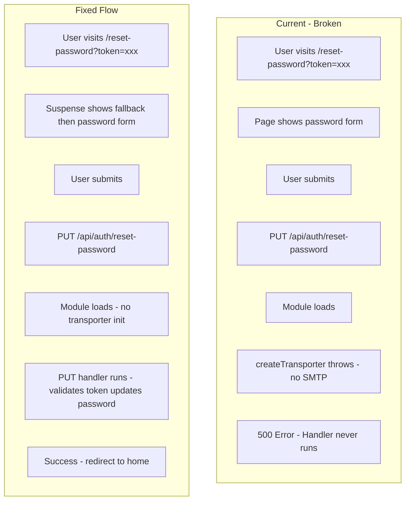

# Fix Reset Password Flow

## Root Cause Analysis

Two issues prevent the reset-password page with token from functioning correctly:

### 1. API Route Module Crash (Critical)

In [src/app/api/auth/reset-password/route.ts](src/app/api/auth/reset-password/route.ts), the nodemailer transporter is created at **module load time** (line 34):

```typescript
const transporter = createTransporter()  // Runs when module first loads
```

`createTransporter()` throws if `SMTP_USER` or `SMTP_PASS` are missing. When a PUT request hits the route (user submits new password), Node loads the module, which immediately throws before the PUT handler runs. Result: **500 error, password reset fails even though PUT does not need email**.

### 2. useSearchParams Without Suspense

The reset-password page in [src/app/reset-password/page.tsx](src/app/reset-password/page.tsx) uses `useSearchParams()` without a Suspense boundary. Next.js requires this for client components to avoid:

- Hydration mismatch (server renders one form, client another based on token)
- CSR bailout / blank state until JS loads

---

## Implementation Plan

### Step 1: Lazy Transporter Initialization (API Route)

**File:** [src/app/api/auth/reset-password/route.ts](src/app/api/auth/reset-password/route.ts)

- Remove the top-level `const transporter = createTransporter()`
- Create a lazy getter that only calls `createTransporter()` when the POST handler needs to send email
- Ensure PUT handler runs independently; it does not use the transporter

```typescript
// Replace module-level transporter with lazy init
let _transporter: ReturnType<typeof createTransporter> | null = null
function getTransporter() {
  if (!_transporter) _transporter = createTransporter()
  return _transporter
}
// In POST handler: use getTransporter() instead of transporter
```

This way, PUT requests work even when SMTP is not configured.

### Step 2: Wrap Reset-Password Page in Suspense

**File:** [src/app/reset-password/page.tsx](src/app/reset-password/page.tsx)

- Extract the content that uses `useSearchParams()` into a client component (e.g. `ResetPasswordForm`)
- Create a page.tsx that wraps it in `<Suspense fallback={...}>`
- Use a simple loading state (e.g. card skeleton or spinner) for the fallback

### Step 3: Improve Error Handling and UX

**In page.tsx:**

- Parse error response defensively: wrap `response.json()` in try/catch; if it fails, use a generic error message
- When API returns "Invalid or expired reset token", show a clear message and a link to request a new reset (e.g. link to same page without token, or to login)
- Remove unused `isValidToken` state variable

**In API route (optional):**

- Ensure all error responses return valid JSON with an `error` field so the client can display them consistently

---

## Data Flow (Current vs Fixed)




---

## Files to Modify


| File                                                                                 | Changes                                                                                |
| ------------------------------------------------------------------------------------ | -------------------------------------------------------------------------------------- |
| [src/app/api/auth/reset-password/route.ts](src/app/api/auth/reset-password/route.ts) | Lazy transporter; use getter only in POST                                              |
| [src/app/reset-password/page.tsx](src/app/reset-password/page.tsx)                   | Suspense wrapper; defensive error parsing; UX for invalid token; remove `isValidToken` |


---

## Verification

1. Visit `http://localhost:3000/reset-password?token=xxx` (use a token from a real reset email, or manually insert one in DB for testing)
2. Enter new password and submit; expect success and redirect to `/`
3. With invalid/expired token, expect clear error and option to request new reset
4. Without SMTP configured, PUT should still succeed (POST will fail when sending email, which is expected)

