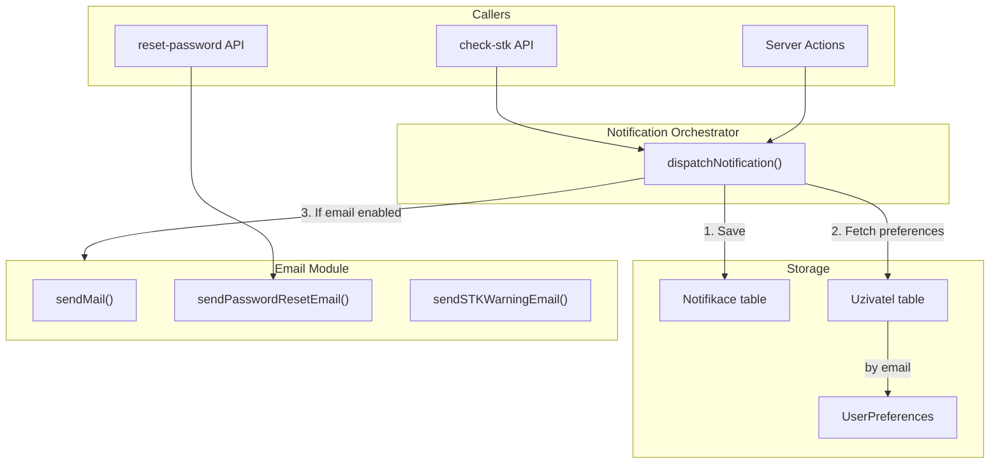

# Notification and Email System Implementation

## Architecture Overview




## 1. Prisma Schema Changes

**File:** [prisma/schema.prisma](prisma/schema.prisma)

Add after the `UzivatelRole` enum (around line 206):

```prisma
enum NotifikaceTyp {
  STK_VAROVANI
  RESET_HESLA
  SCHVALENI
  NOVY_UZIVATEL
  SYSTEM
}
```

Add the `Notifikace` model (after `Uzivatel`, around line 220):

```prisma
model Notifikace {
  id         Int           @id @default(autoincrement())
  uzivatelId Int
  uzivatel   Uzivatel      @relation(fields: [uzivatelId], references: [id], onDelete: Cascade)
  typ        NotifikaceTyp
  titul      String
  obsah      String?       @db.Text
  precteno   Boolean       @default(false)
  vytvoreno  DateTime      @default(now())
  odkaz      String?

  @@index([uzivatelId])
  @@index([precteno, uzivatelId])
}
```

Update the `Uzivatel` model to add the inverse relation:

```prisma
notifikace  Notifikace[]
```

Run `npx prisma migrate dev --name add_notifikace` after schema changes.

---

## 2. Create Generic Email Utility

**File:** [src/lib/email.ts](src/lib/email.ts) (new file)

- **Transporter setup**: Use `process.env.SMTP_HOST`, `SMTP_PORT`, `SMTP_USER`, `SMTP_PASS`, `SMTP_FROM` (matching existing [src/lib/emailService.ts](src/lib/emailService.ts)).
- **Fallback**: If credentials are missing (`!SMTP_HOST || !SMTP_USER`), log `console.warn('SMTP not configured - emails will be skipped')` and export a no-op `sendMail` that returns immediately without throwing.
- **Base function**:

```typescript
  export async function sendMail(params: { to: string; subject: string; html: string; text?: string }): Promise<void>
  

```

- **Template functions**:
  - `sendPasswordResetEmail(to: string, resetUrl: string): Promise<void>` - HTML template with "Reset hesla" subject, link styled like [src/app/api/auth/reset-password/route.ts](src/app/api/auth/reset-password/route.ts).
  - `sendSTKWarningEmail(to: string, vehicles: Array<{ spz: string; znacka: string; model: string; datumSTK: Date }>): Promise<void>` - Reuse the table layout from [src/lib/emailService.ts](src/lib/emailService.ts) lines 25-50.
- **Error handling**: Each function should `try/catch` and log errors; do not throw to caller (let orchestrator handle gracefully).

---

## 3. Create Notification Orchestrator

**File:** [src/lib/notifications.ts](src/lib/notifications.ts) (new file)

Import `db` from [src/lib/prisma.ts](src/lib/prisma.ts) (use `db`, not `prisma`, per constraints).

**Main function signature**:

```typescript
type NotifikaceTyp = 'STK_VAROVANI' | 'RESET_HESLA' | 'SCHVALENI' | 'NOVY_UZIVATEL' | 'SYSTEM'

interface DispatchNotificationParams {
  userId: number;           // Uzivatel.id
  type: NotifikaceTyp;
  title: string;
  message: string;
  link?: string;
  emailData?: {
    to: string;            // Override recipient (default: Uzivatel.email)
    templateData?: Record<string, unknown>;  // e.g. { vehicles, resetUrl }
  };
}

export async function dispatchNotification(params: DispatchNotificationParams): Promise<void>
```

**Logic** (execute in order, errors in one step should not prevent others):

1. **Save to DB** (always): `db.notifikace.create({ data: { uzivatelId, typ, titul: title, obsah: message, odkaz: link } })`. Map `type` to `NotifikaceTyp` enum.
2. **Resolve email preference**:
  - Fetch `uzivatel` via `db.uzivatel.findUnique({ where: { id: userId } })`.
  - If no uzivatel, skip email (log warning).
  - For preference: Find `User` by `email = uzivatel.email`, then `UserPreferences` by `userId = user.id`. If `userPreferences.emailNotifications === false`, skip email. Default to `true` if no User/UserPreferences found (permissive for Uzivatel-only users).
3. **Send email** (if preference allows and `emailData` provided):
  - Use `emailData.to` or `uzivatel.email`.
  - Switch on `type` and call the appropriate template from `email.ts`:
    - `STK_VAROVANI` -> `sendSTKWarningEmail(to, emailData.templateData.vehicles)`
    - `RESET_HESLA` -> `sendPasswordResetEmail(to, emailData.templateData.resetUrl)`
    - Others: optional generic `sendMail({ to, subject, html })` with title/message, or skip if no template.
  - Wrap in try/catch; log error but do not throw (DB notification already saved).

---

## 4. Migrate Existing Email Usage

- **[src/app/api/notifications/check-stk/route.ts](src/app/api/notifications/check-stk/route.ts)**: Keep current flow (no per-user notifications yet; sends to `NOTIFICATION_EMAIL`). Replace `sendSTKNotification` with `sendSTKWarningEmail` from `src/lib/email.ts`. The task does not require changing this to per-user dispatch; that can be a follow-up.
- **[src/app/api/cron-simulation/route.ts](src/app/api/cron-simulation/route.ts)** and **[src/app/api/test-email/route.ts](src/app/api/test-email/route.ts)**: Same replacement: use `sendSTKWarningEmail` from `email.ts`.
- **Deprecate** [src/lib/emailService.ts](src/lib/emailService.ts): Re-export `sendSTKWarningEmail` as `sendSTKNotification` for backward compatibility during transition, or delete and update all imports to `email.ts`.

---

## 5. Reset Password Integration (Optional Enhancement)

The reset-password flow in [src/app/api/auth/reset-password/route.ts](src/app/api/auth/reset-password/route.ts) uses `prisma.user` (legacy) and its own nodemailer. For full consistency:

- Consider migrating to `sendPasswordResetEmail` from `email.ts`.
- Note: Reset flow uses `User` model; `dispatchNotification` targets `Uzivatel`. A separate task would unify auth to Uzivatel-only. For now, the email utility can be used without calling `dispatchNotification` for reset (no in-app notification needed for reset).

---

## 6. TypeScript Types and Error Handling

- Use `NotifikaceTyp` from `@prisma/client` in `notifications.ts`.
- All async functions in `email.ts` and `notifications.ts` should catch errors internally; `dispatchNotification` never throws.
- Ensure `db` from prisma.ts is used (Notifikace/Uzivatel don't use soft delete, but consistency with codebase).

---

## Summary of New/Modified Files


| File                                           | Action                                                                                       |
| ---------------------------------------------- | -------------------------------------------------------------------------------------------- |
| `prisma/schema.prisma`                         | Add `NotifikaceTyp` enum, `Notifikace` model, `notifikace` relation on `Uzivatel`            |
| `src/lib/email.ts`                             | **Create** – base `sendMail`, `sendPasswordResetEmail`, `sendSTKWarningEmail`, SMTP fallback |
| `src/lib/notifications.ts`                     | **Create** – `dispatchNotification` orchestrator                                             |
| `src/lib/emailService.ts`                      | **Update** – Re-export from `email.ts` or delete and update imports                          |
| `src/app/api/notifications/check-stk/route.ts` | **Update** – Use `sendSTKWarningEmail` from `email.ts`                                       |
| `src/app/api/cron-simulation/route.ts`         | **Update** – Use `sendSTKWarningEmail` from `email.ts`                                       |
| `src/app/api/test-email/route.ts`              | **Update** – Use `sendSTKWarningEmail` from `email.ts`                                       |


