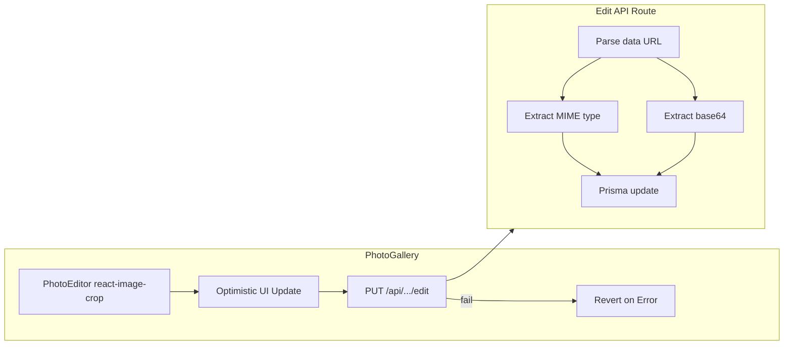

# Photo Gallery and Edit Pipeline Fix

## 1. Image Rendering in PhotoGallery

**File:** [src/components/dashboard/PhotoGallery.tsx](src/components/dashboard/PhotoGallery.tsx)

### Gallery items (lines 150-168)

- **Parent container** (lines 151-156): Add `bg-muted/20` to the outer card div. The current classes are:

```tsx
  className={`relative group rounded-lg overflow-hidden border shadow-sm transition-all duration-200 hover:shadow-md ${...}`}
  

```

  Change to include `bg-muted/20`:

```tsx
  className={`relative group rounded-lg overflow-hidden border shadow-sm transition-all duration-200 hover:shadow-md bg-muted/20 ${...}`}
  

```

- **Inner wrapper** (line 158): Add `flex items-center justify-center` and apply the fixed height from `getPhotoSizeClass()` so the image is centered:

```tsx
  <div className={`relative flex items-center justify-center ${getPhotoSizeClass()}`}>
  

```

- **Image element** (lines 159-168):
  - Change `object-cover` to `object-contain` in the className.
  - Remove the inline `style` prop entirely (objectPosition and objectFit). With `object-contain`, the full image will be visible and centered; custom positioning would conflict.
  - Keep `w-full` and `transition-transform duration-300 group-hover:scale-105`.
  - Final: `className={`w-full object-contain transition-transform duration-300 group-hover:scale-105 max-h-full max-w-full`}`

### Fullscreen view (lines 309-314)

- Already uses `object-contain`. No change needed.

---

## 2. Dynamic Photo Resizing

- Keep `getPhotoSizeClass()` as-is (returns `h-32 md:h-40`, `h-44 md:h-56`, `h-56 md:h-72`).
- Apply `getPhotoSizeClass()` to the inner wrapper div (the one with `flex items-center justify-center`) so it defines the fixed-height container.
- The image inside uses `max-h-full max-w-full object-contain`, so it will scale within the container and stay centered via flex.

---

## 3. Edit API Route

**File:** [src/app/api/auta/[id]/fotky/[fotoId]/edit/route.ts](src/app/api/auta/[id]/fotky/[fotoId]/edit/route.ts)

Replace the current parsing and update logic with:

```ts
const { imageData } = await request.json();

if (!imageData || typeof imageData !== 'string') {
  return NextResponse.json({ error: 'No image data provided' }, { status: 400 });
}

// Extract MIME type from data URL (e.g. data:image/png;base64,...)
const mimeMatch = imageData.match(/^data:(.*?);base64,/);
const mimeType = mimeMatch ? mimeMatch[1] : 'image/jpeg';

// Extract raw base64 string (everything after the comma)
const base64Data = imageData.split(',')[1];
if (!base64Data) {
  return NextResponse.json({ error: 'Invalid base64 data' }, { status: 400 });
}

// Validate base64 before saving
try {
  Buffer.from(base64Data, 'base64');
} catch {
  return NextResponse.json({ error: 'Invalid base64 encoding' }, { status: 400 });
}

// Update Prisma with both mimeType and base64Data
const updatedPhoto = await prisma.fotka.update({
  where: { id: params.fotoId },
  data: {
    data: base64Data,
    mimeType,
  },
});
```

- Do not hardcode `mimeType: 'image/jpeg'`.
- Use the parsed `mimeType` and `base64Data` in the Prisma update.

---

## 4. Error Handling in PhotoGallery Edit Flow

**File:** [src/components/dashboard/PhotoGallery.tsx](src/components/dashboard/PhotoGallery.tsx)

**Current flow (lines 243-289):** Optimistic update runs first, then fetch. On error, toast is shown but state is not reverted.

**Changes:**

1. **Reorder logic:** Perform the fetch first. Only apply the optimistic update after a successful response (or keep optimistic update but add explicit rollback on failure).
2. **Recommended approach (optimistic with rollback):**
  - Store the previous photo state before updating: `const previousPhotos = [...localPhotos];`
  - Apply optimistic update as today.
  - In the `catch` block (or when `!response.ok`): revert with `setLocalPhotos(previousPhotos)` and, if the edited photo was in fullscreen, `setFullscreenPhoto(editingPhoto)` (original, not updated).
  - Use clear Czech messages:
    - Success: `title: "Úspěch", description: "Fotografie byla úspěšně upravena."`
    - Error: `title: "Chyba", description: "Nepodařilo se uložit upravenou fotografii."`
3. **Toast API:** The project uses shadcn `toast` from `@/components/ui/use-toast` (not Sonner). Keep the existing pattern:

```tsx
   toast({ title: "Úspěch", description: "Fotografie byla úspěšně upravena." });
   toast({ title: "Chyba", description: "Nepodařilo se uložit upravenou fotografii.", variant: "destructive" });
   

```

1. **Revert logic:** In the catch block:

```tsx
   setLocalPhotos(previousPhotos);
   if (fullscreenPhoto?.id === editingPhoto.id) {
     setFullscreenPhoto(editingPhoto); // Restore original
   }
   

```

---

## 5. Summary of Edits


| File             | Changes                                                                                                                                                                                             |
| ---------------- | --------------------------------------------------------------------------------------------------------------------------------------------------------------------------------------------------- |
| PhotoGallery.tsx | Add `bg-muted/20` to card; inner div with `flex items-center justify-center` + `getPhotoSizeClass()`; img: `object-contain`, remove inline style; edit flow: revert on error, update toast messages |
| edit/route.ts    | Parse MIME from data URL; extract base64 with `split(',')[1]`; validate base64; save both `mimeType` and `data`                                                                                     |


---

## Data Flow (Edit Pipeline)




