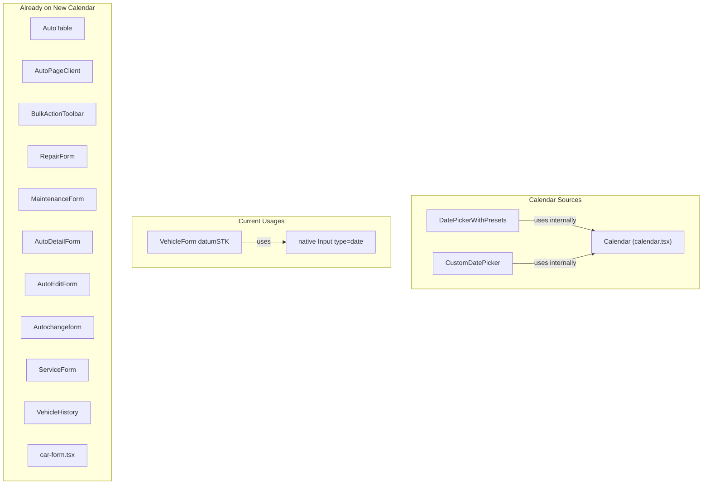

# Unified Calendar Migration Plan

## Current State

**All DatePickerWithPresets and CustomDatePicker instances already use the new Calendar** from [src/components/ui/calendar.tsx](src/components/ui/calendar.tsx), which was updated with react-day-picker v9 classNames (weekdays, weekday, etc.).

## Tasks

### 1. Replace native date input in VehicleForm with DatePickerWithPresets

**File:** [src/features/fleet/components/VehicleForm.tsx](src/features/fleet/components/VehicleForm.tsx)

The `datumSTK` field (lines 644-671) uses `<Input type="date">`. Replace it with DatePickerWithPresets wrapped in Popover to match the design used everywhere else.

- Add imports: `DatePickerWithPresets`, `Popover`, `PopoverContent`, `PopoverTrigger`, `Button`, `format` from date-fns, `cs` locale
- Replace `Calendar` icon import from lucide-react with `CalendarIcon` (to avoid confusion; the label icon can stay as Calendar or switch to CalendarIcon)
- Replace the Input block with Popover + DatePickerWithPresets pattern (same as RepairForm, MaintenanceForm, etc.)
- Handle `field.value` as Date | string for compatibility with form state

### 2. Remove unused Calendar imports

These files import `Calendar` from `@/components/ui/calendar` but never render it (they use DatePickerWithPresets which has Calendar internally):

| File                                                                             | Action                                                       |
| -------------------------------------------------------------------------------- | ------------------------------------------------------------ |
| [src/components/maps/VehicleHistory.tsx](src/components/maps/VehicleHistory.tsx) | Remove `import { Calendar } from "@/components/ui/calendar"` |
| [src/components/forms/ServiceForm.tsx](src/components/forms/ServiceForm.tsx)     | Remove `import { Calendar } from '@/components/ui/calendar'` |
| [src/components/dashboard/AutoTable.tsx](src/components/dashboard/AutoTable.tsx) | Remove `import { Calendar } from "@/components/ui/calendar"` |

### 3. Verify no prop overrides bypass new styles

Confirm that no caller passes `classNames` to DatePickerWithPresets or CustomDatePicker that would override UNIFIED_CALENDAR_CLASSNAMES. Current usages do not pass classNames, so no changes needed.

### 4. Optional: Align CustomDatePicker vs DatePickerWithPresets

[car-form.tsx](src/app/dashboard/admin/cars/car-form.tsx) uses CustomDatePicker. Both CustomDatePicker and DatePickerWithPresets now use the same UNIFIED_CALENDAR_CLASSNAMES and Vymazat/Dnes footer. No change required unless you want to standardize on one component (DatePickerWithPresets) everywhere. CustomDatePicker is fine as-is.

## Summary of file changes

| File                                            | Change                                               |
| ----------------------------------------------- | ---------------------------------------------------- |
| `src/features/fleet/components/VehicleForm.tsx` | Replace native date input with DatePickerWithPresets |
| `src/components/maps/VehicleHistory.tsx`        | Remove unused Calendar import                        |
| `src/components/forms/ServiceForm.tsx`          | Remove unused Calendar import                        |
| `src/components/dashboard/AutoTable.tsx`        | Remove unused Calendar import                        |

## Out of scope

- **lucide-react Calendar**: Used as an icon in MaintenanceAlerts, VehicleForm, DashboardPageClient, data-table-floating-bar, BulkActionToolbar, VehicleDashboard, DashboardNav, homepage. These are icons, not date pickers—no change.

