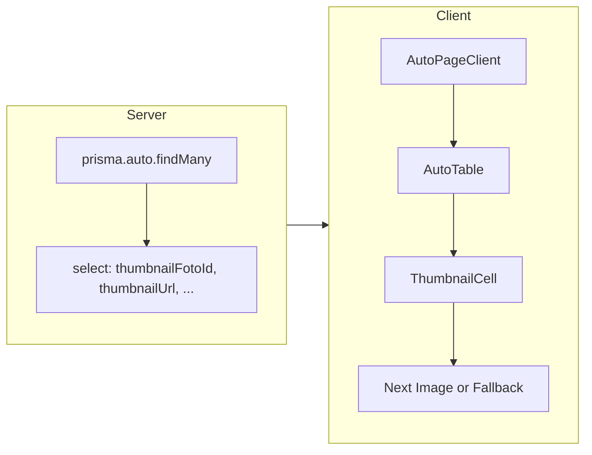

# Vehicle thumbnails fix

## Context

- **Actual file**: The vehicle table component lives at [src/components/dashboard/AutoTable.tsx](src/components/dashboard/AutoTable.tsx) (there is no `src/components/auta/AutoTable.tsx`). The plan targets the dashboard file.
- Thumbnails are shown in two places: **desktop table** (64×64, `h-16 w-16`) and **mobile card** (96×96, `h-24 w-24`). Both use the same URL logic and currently use `` with an `ImageIcon` fallback when URL is missing or on error.
- Fullscreen preview is driven by `fullscreenPhoto` state and a single `Dialog` in the table; thumbnail cells only need to call a callback (e.g. `onPreview(url)`) on click.

## 1. Data fetching – include thumbnail fields

**File:** [src/app/dashboard/auta/page.tsx](src/app/dashboard/auta/page.tsx)

- In the existing `prisma.auto.findMany({ ... select: { ... } })`, add to the `select` object:
  - `thumbnailFotoId: true`
  - `thumbnailUrl: true`
- No other changes to the query or serialization (the rest is already spread into `serializedVehicles`).

**Downstream type:** In [src/components/dashboard/AutoPageClient.tsx](src/components/dashboard/AutoPageClient.tsx), extend the `Vehicle` type with `thumbnailFotoId?: string | null` and `thumbnailUrl?: string | null` so the props passed to `AutoTable` are correctly typed.

---

## 2. Next.js image config – allow API photo URLs

**File:** [next.config.ts](next.config.ts)

- Next.js `<Image />` will request URLs like `/api/auta/[id]/fotky/[fotoId]`. The image optimizer must be allowed to fetch them.
- Add a second entry to `images.remotePatterns` (keep the existing `/uploads/`** entry):
  - `pathname: '/api/auta/**'` (same `protocol`, `hostname`, `port` as the existing localhost pattern).
- This avoids "Invalid src prop" or optimizer blocking the API route. If the app is also deployed, add a matching pattern for the production host (or a generic pattern) as needed.

---

## 3. ThumbnailCell component and usage

**File:** [src/components/dashboard/AutoTable.tsx](src/components/dashboard/AutoTable.tsx)

**New internal component: `ThumbnailCell`**

- Define **above** the main `AutoTable` export (or at the top of the file after imports), as a small client component (file is already `'use client'`).
- **Props:** Accept a subset of `Auto` needed for the thumbnail and preview:
  - `auto: { id: string | number; thumbnailUrl?: string | null; thumbnailFotoId?: string | null; znacka: string; model: string }`
  - `onPreview?: (url: string) => void` – called when the thumbnail is clicked (to open fullscreen).
  - `size?: 'sm' | 'md'` – optional; `sm` = 64×64 (table), `md` = 96×96 (mobile card). Default `sm` to match current table cell.
- **URL construction (inside ThumbnailCell):**
  - If `auto.thumbnailUrl` is present, use it as `src` (optionally append a cache-bust query param, e.g. `?t=${Date.now()}`).
  - Else if `auto.thumbnailFotoId` is present, use relative path: `/api/auta/${auto.id}/fotky/${auto.thumbnailFotoId}` (plus optional `?t=...`).
  - Otherwise `src` is null → show fallback only.
- **State:** `const [hasError, setHasError] = useState(false)`.
- **Render logic:**
  - If there is no `src` **or** `hasError` is true: render the fallback (grey container with `<ImageIcon />` from `lucide-react`). Use the same Tailwind classes as today for the fallback (e.g. `flex h-16 w-16 items-center justify-center rounded-md bg-gray-100` for `sm`, and equivalent for `md`).
  - Else: render Next.js `<Image />` with:
    - `src` = constructed URL
    - `width` and `height`: 64 for `sm`, 96 for `md` (or 40 if you prefer a smaller table cell; current UI is 64).
    - `alt="Náhled vozidla"` (Czech, as requested)
    - `className="rounded-md object-cover"`
    - `onError`: call `setHasError(true)` (and optionally `console.error` for debugging).
    - Wrapper: same as current (e.g. `relative h-16 w-16 overflow-hidden rounded-md bg-gray-100 cursor-pointer hover:opacity-90 ...`) and `onClick={() => onPreview?.(src)}` on the wrapper so fullscreen still works.
- **Unoptimized (if needed):** If the API route requires cookies and the optimizer does not send them, use `unoptimized={true}` for the API `src` so the browser loads the image directly. Otherwise keep default optimization.

**Replace desktop table thumbnail block (lines ~2027–2095)**

- Replace the inline IIFE that builds `thumbnailUrl`, renders ``, fallback, and the **inline** `Dialog` with:
  - A single `<ThumbnailCell auto={auto} onPreview={setFullscreenPhoto} size="sm" />`.
- **Keep the fullscreen Dialog once at the table level** (outside the row map): one `Dialog` that uses `fullscreenPhoto` and `setFullscreenPhoto(null)` on close. Move it so it is not duplicated per row (e.g. after the table, or at the end of the component). Pass the current `fullscreenPhoto` and the dialog content (current structure with `` and close button) so the existing fullscreen behavior is unchanged.

**Replace mobile card thumbnail block (lines ~2342–2407)**

- Replace the inline `thumbnailUrl` computation and the conditional `` / fallback div with:
  - `<ThumbnailCell auto={auto} onPreview={setFullscreenPhoto} size="md" />`.
- Reuse the same single fullscreen Dialog; no second Dialog in the mobile view.

**Cleanup**

- Remove the old `getThumbnailUrl` helper if it becomes unused after this refactor (it is used elsewhere for refresh/cache-bust; if ThumbnailCell owns URL construction, keep any other usage of `getThumbnailUrl` or inline the logic only where still needed).
- Ensure `Image` is imported from `next/image` (already present in the file).

---

## 4. Summary of behavior and constraints

- **React 18 / Next.js 14 App Router:** No legacy APIs; use functional components and hooks.
- **Styling:** Preserve existing Tailwind and shadcn/ui classes; only replace the thumbnail fragment with `ThumbnailCell`.
- **Language:** Variables and function names in English; visible UI strings in Czech (e.g. `alt="Náhled vozidla"`).
- **Flow:** Server passes `thumbnailFotoId` and `thumbnailUrl` → client receives them on each vehicle → `ThumbnailCell` builds `src`, shows `<Image />` or fallback, and reports load errors via local state so each row’s image state is independent.

---

## Optional diagram (data flow)

