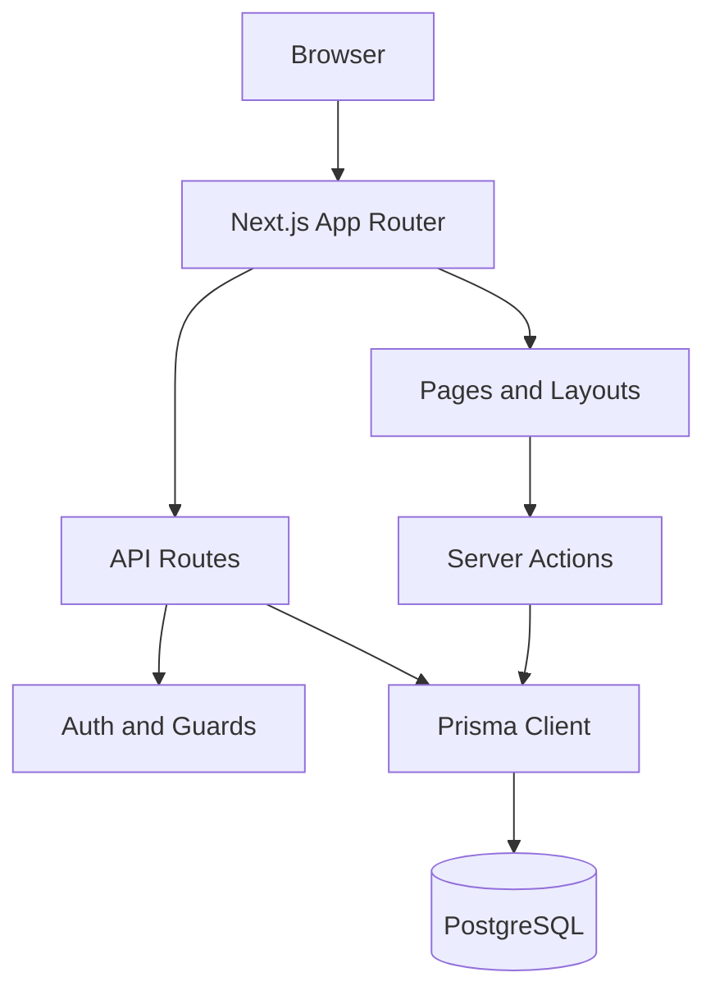

# Dopravni system vondrasek

Kompletni dokumentace projektu pro vyvojare i uzivatele/adminy.

## Obsah

- [O projektu](#o-projektu)
- [Rychly orientacni rozcestnik](#rychly-orientacni-rozcestnik)
- [Hlavni funkcionalita](#hlavni-funkcionalita)
- [Role a opravneni](#role-a-opravneni)
- [Architektura](#architektura)
- [Struktura projektu](#struktura-projektu)
- [Rychly start pro vyvoj](#rychly-start-pro-vyvoj)
- [NPM skripty](#npm-skripty)
- [Konfigurace prostredi (.env)](#konfigurace-prostredi-env)
- [Databaze a Prisma](#databaze-a-prisma)
- [Backend a API prehled](#backend-a-api-prehled)
- [Autentizace a reset hesla](#autentizace-a-reset-hesla)
- [Provoz, cron a emaily](#provoz-cron-a-emaily)
- [Bezpecnostni a provozni upozorneni](#bezpecnostni-a-provozni-upozorneni)
- [Troubleshooting](#troubleshooting)
- [Dalsi dokumentace](#dalsi-dokumentace)
- [Licence](#licence)

## O projektu

`dopravni-system-vondrasek` je webova aplikace pro spravu vozoveho parku a souvisejicich procesu:

- sprava vozidel (aktivni/archivovana, detail vozidla, fotografie, historie)
- finance (transakce, kategorie, faktury, reporty)
- opravy a udrzba
- GPS data a prehled poloh
- uzivatele, role, opravneni a administrace
- notifikace (napr. upozorneni na STK)
- ridicske flow pro distribuci novin

Technologie:

- Next.js 14 (App Router), React 18, TypeScript
- Prisma ORM + PostgreSQL
- NextAuth (Credentials provider)
- Tailwind CSS + shadcn/ui

## Rychly orientacni rozcestnik

### Jsem uzivatel/admin

- Prihlaseni je na `/` (`src/app/page.tsx`).
- Hlavni aplikace bezi na routach pod `/dashboard/*` a `/homepage`.
- Reset hesla je na `/reset-password`.
- Pri vypnuti systemu se zobrazi `/maintenance`.

### Jsem vyvojar

- Zacni sekci [Rychly start pro vyvoj](#rychly-start-pro-vyvoj).
- Pak pokracuj na [Konfigurace prostredi (.env)](#konfigurace-prostredi-env).
- Pro data a migrace viz [Databaze a Prisma](#databaze-a-prisma).

## Hlavni funkcionalita

Klicove moduly (UI):

- Vozidla: `/dashboard/auta`, detail `/dashboard/auta/[id]`, pridani `/dashboard/auta/pridej`
- Transakce: `/dashboard/transakce`
- Opravy: `/dashboard/opravy`
- Grafy/analytics: `/dashboard/grafy`
- Soubory: `/dashboard/soubory`
- Ucet a nastaveni: `/dashboard/account`, `/dashboard/settings`
- Admin: `/dashboard/admin/users`, `/dashboard/admin/settings`, `/dashboard/admin/driver-settings`
- Driver distribuce:  
  - `/dashboard/noviny/distribuce/driver-login`  
  - `/dashboard/noviny/distribuce/driver-route`  
  - `/dashboard/noviny/distribuce/driver-restricted`  
  - `/dashboard/noviny/distribuce/driver-reset-password`
- Systemove stranky: `/reset-password`, `/maintenance`, `/homepage`

## Role a opravneni

Opravneni jsou rizena pres:

- JWT/session data (`role`, `allowedPages`, `defaultLandingPage`)
- middleware route guard v `src/middleware.ts`
- role konfiguraci v DB (tabulka `Role`, vazby `RolePermission`)

Dulezite chovani:

- `ADMIN` obchazi kontrolu `allowedPages` v middleware.
- U ostatnich roli middleware povoli jen cesty z `allowedPages` (plus bezpecne prefix pravidlo).
- U route `/dashboard` je hard redirect na `/dashboard/auta`.

## Architektura


```mermaid
flowchart TD
    Browser[Browser] --> AppRouter[Next.js App Router]
    AppRouter --> Pages[Pages and Layouts]
    AppRouter --> ApiRoutes[API Routes]
    Pages --> ServerActions[Server Actions]
    ApiRoutes --> AuthLayer[Auth and Guards]
    ServerActions --> PrismaLayer[Prisma Client]
    ApiRoutes --> PrismaLayer
    PrismaLayer --> Postgres[(PostgreSQL)]
```

## Struktura projektu

```text
dopravni-system-vondrasek/
├── prisma/                  # schema, migrations, seed
├── public/                  # staticke soubory
├── scripts/                 # pomocne skripty (napr. tunnel)
├── src/
│   ├── app/                 # App Router: pages + api + actions
│   ├── components/          # UI a feature komponenty
│   ├── hooks/               # custom hooky
│   ├── lib/                 # auth, prisma, email, utility
│   ├── providers/           # React providery
│   ├── types/               # type extensions (NextAuth)
│   ├── utils/               # dalsi utility
│   └── middleware.ts        # centralni guard
├── next.config.js
├── package.json
└── README.md
```

## Rychly start pro vyvoj

Predpoklady:

- Node.js 18+ (doporuceno 20+)
- PostgreSQL
- npm nebo pnpm (`package-lock.json` i `pnpm-lock.yaml` jsou v repu)

Instalace:

```bash
npm install
```

Inicializace DB:

```bash
npx prisma generate
npx prisma migrate dev
npm run db:seed
```

Spusteni:

```bash
npm run dev
```

Aplikace pobězi na `http://localhost:3000`.

## NPM skripty

Skripty z `package.json`:

- `npm run dev` - vyvojovy server (`next dev -H 0.0.0.0`)
- `npm run dev:tunnel` - dev server + Cloudflare tunnel
- `npm run tunnel` - pouze tunnel
- `npm run build` - produkcni build
- `npm run start` - spusteni produkcniho buildu
- `npm run lint` - eslint
- `npm run db:seed` - seed databaze
- `npm run db:fix-roles` - oprava nekonzistentnich roli

## Konfigurace prostredi (.env)

Projekt nema committed `.env.example`, vytvor si lokalni `.env` podle tabulky:

| Promenna | Povinna | Popis |
|---|---|---|
| `DATABASE_URL` | ano | PostgreSQL connection string (Prisma datasource) |
| `NEXTAUTH_SECRET` | ano | secret pro NextAuth JWT/session |
| `NEXTAUTH_URL` | doporuceno | URL aplikace pro auth callbacky |
| `NEXT_PUBLIC_APP_URL` | doporuceno | zaklad URL pro odkazy v emailech (reset hesla, reporty) |
| `SMTP_HOST` | volitelne* | SMTP host |
| `SMTP_PORT` | volitelne* | SMTP port (default 587) |
| `SMTP_USER` | volitelne* | SMTP user |
| `SMTP_PASS` | volitelne* | SMTP heslo (pozor: pouziva se `SMTP_PASS`, ne `SMTP_PASSWORD`) |
| `SMTP_FROM` | volitelne | From adresa; fallback na `SMTP_USER` |
| `SMTP_SECURE` | volitelne | `true/false`, v reset route je podporovana |
| `NOTIFICATION_EMAIL` | pro STK emaily | cilova adresa pro STK notifikace |
| `CRON_SECRET` | silne doporuceno v produkci | ochrana cron endpointu |
| `GPS_API_KEY` | pro GPS endpoint | API klic pro `/api/gps/receive` |

\* Bez SMTP bude cast email funkci preskocena nebo vrati chybu podle endpointu.

## Databaze a Prisma

Schema: `prisma/schema.prisma` (PostgreSQL provider).

Zakladni Prisma prikazy:

```bash
npx prisma generate
npx prisma migrate dev
npx prisma studio
```

Reset databaze (destruktivni):

```bash
npx prisma migrate reset
```

Seed:

- hlavni seed je `prisma/seed.ts`
- v projektu je i legacy `prisma/seed.cjs`

Poznamka k Prisma klientum:

- `src/lib/prisma.ts` exportuje:
  - `db` (extended client se soft-delete pravidly pro `Auto`)
  - `prisma` (base client bez soft-delete extension)

## Backend a API prehled

API routy jsou v `src/app/api/*` (cca 60 route handleru).

Hlavni domeny:

- `api/auth/*` - NextAuth, init, reset hesla
- `api/admin/*` - uzivatele, role, settings, preference
- `api/user/*` a `api/users/*` - profil, heslo, preference, listy
- `api/auta/*` - vozidla, foto, GPS, archivace, bulk operace
- `api/transakce/*` - finance a faktury
- `api/driver-login/*` - ridicske prihlaseni, lock status, logs, confirm route
- `api/notifications/*` - STK notifikace
- `api/gps/*` - ingest GPS dat
- `api/dashboard/*` - agregovana data pro dashboard
- `api/send-report`, `api/maintenance-status`, `api/test-email`, `api/cron-simulation`

## Autentizace a reset hesla

Auth:

- Konfigurace: `src/lib/auth.config.ts`
- Handler: `src/app/api/auth/[...nextauth]/route.ts`
- Guard: `src/middleware.ts`

Reset hesla:

- UI: `src/app/reset-password/page.tsx` + `src/app/reset-password/ResetPasswordForm.tsx`
- API: `src/app/api/auth/reset-password/route.ts`
- Token je ukladan v `Uzivatel.resetToken` + `resetTokenExpiry`
- Platnost reset tokenu je 1 hodina

## Provoz, cron a emaily

Cron:

- `vercel.json` spousti denne `/api/notifications/check-stk` (9:00)
- endpoint umi overit `Authorization: Bearer <CRON_SECRET>`

Emaily:

- centralni mail helper: `src/lib/email.ts`
- reset hesla ma vlastni route implementaci v `src/app/api/auth/reset-password/route.ts`
- STK upozorneni a reporty vyuzivaji SMTP konfiguraci

Tunnel:

- `scripts/tunnel.js` spousti Cloudflare tunnel pres `npx cloudflared`

## Bezpecnostni a provozni upozorneni

- **Seed ucty:** `prisma/seed.ts` vytvari default admin ucty:
  - `admin@test.com / admin123` (model `Uzivatel`, pouzivany NextAuth)
  - `admin@admin.com / Admin123!` (legacy `User`)
- **Dev endpointy:** nektere endpointy jsou dostupne jen v developmentu (`auth/init`, `test-email`, `cron-simulation`).
- **CRON_SECRET:** pokud neni nastaven, cron endpoint muze byt snadno volatelny bez dodatecneho tajemstvi.
- **SMTP promenna:** v runtime kodu je pouzivana `SMTP_PASS`, ne `SMTP_PASSWORD`.
- **Reset DB:** `prisma migrate reset` smaze data.
- **Build quality:** `next.config.js` ma zapnute `ignoreBuildErrors` a `ignoreDuringBuilds`; pred produkcnim release doporuceno zvazit stricter nastaveni.

## Troubleshooting

- **Nefunguje login:** zkontroluj `NEXTAUTH_SECRET`, DB pripojeni a seed ucty.
- **Nefunguji emaily:** zkontroluj `SMTP_HOST`, `SMTP_PORT`, `SMTP_USER`, `SMTP_PASS`, `SMTP_FROM`.
- **Nefunguje reset hesla URL:** zkontroluj `NEXT_PUBLIC_APP_URL` (jinak fallback na localhost).
- **STK cron neposila emaily:** zkontroluj `NOTIFICATION_EMAIL`, `CRON_SECRET`, a deploy cron ve `vercel.json`.
- **GPS endpoint vraci chybu:** over `GPS_API_KEY`.
- **Nejde prisma migrate:** over `DATABASE_URL` a dostupnost PostgreSQL.

## Dalsi dokumentace

Doporucene navazujici dokumenty:

- [Dokumentacni index](./DOCUMENTATION_INDEX.md)
- [Souhrn dokumentace](./DOCUMENTATION_SUMMARY.md)
- [App Router](./src/app/README.md)
- [API Routes](./src/app/api/README.md)
- [Server Actions](./src/app/actions/README.md)
- [Prisma databaze](./prisma/README.md)
- [Komponenty](./src/components/README.md)
- [Lib utility](./src/lib/README.md)
- [Hooks](./src/hooks/README.md)
- [Types](./src/types/README.md)
- [Providers](./src/providers/README.md)
- [Scripts](./scripts/README.md)

## Licence

Projekt je veden jako soucast maturitni prace.
