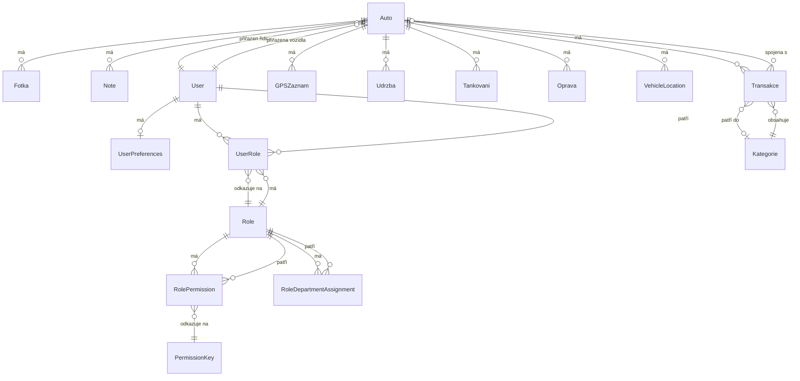

# Databázová Dokumentace

## Úvod

Tento dokument popisuje databázovou strukturu Fleet Management Systemu. Databáze je navržena pomocí Prisma ORM, což zajišťuje type-safe přístup k datům a automatickou synchronizaci mezi schématem a databázovými migracemi.

Databáze využívá PostgreSQL jako relační databázový systém, který poskytuje robustní podporu pro komplexní vztahy mezi entitami, transakce a pokročilé dotazy.

## Popis Modelů

### Auto (Vozidlo)

Hlavní entita reprezentující vozidlo ve vozovém parku.

**Atributy:**
- `id` (Int, Primary Key) - Jedinečný identifikátor vozidla
- `spz` (String, Unique) - Státní poznávací značka vozidla
- `znacka` (String) - Značka vozidla (např. Škoda, Volkswagen)
- `model` (String) - Model vozidla
- `rokVyroby` (Int) - Rok výroby vozidla
- `najezd` (Int) - Celkový nájezd vozidla v kilometrech
- `stav` (String) - Aktuální stav vozidla (např. "provozní", "servis", "rezervováno")
- `poznamka` (String?, Optional) - Volitelná poznámka k vozidlu
- `datumSTK` (DateTime?, Optional) - Datum příští technické kontroly
- `thumbnailFotoId` (String?, Optional) - ID náhledové fotografie
- `thumbnailUrl` (String?, Optional) - URL náhledové fotografie
- `aktivni` (Boolean, Default: true) - Zda je vozidlo aktivní
- `gpsDeviceId` (String?, Optional, Unique) - ID GPS zařízení přiřazeného k vozidlu
- `lastLatitude` (Float?, Optional) - Poslední známá zeměpisná šířka
- `lastLongitude` (Float?, Optional) - Poslední známá zeměpisná délka
- `lastLocationUpdate` (DateTime?, Optional) - Čas poslední aktualizace polohy
- `department` (String?, Optional) - Přiřazení k oddělení pro role-based access
- `assignedDriver` (String?, Optional) - ID přiřazeného řidiče
- `createdAt` (DateTime) - Datum vytvoření záznamu
- `updatedAt` (DateTime) - Datum poslední aktualizace

**Vztahy:**
- `fotky` - Jeden k mnoha (Fotka[])
- `poznatky` - Jeden k mnoha (Note[])
- `transakce` - Jeden k mnoha (Transakce[])
- `gpsZaznamy` - Jeden k mnoha (GPSZaznam[])
- `udrzby` - Jeden k mnoha (Udrzba[])
- `tankovani` - Jeden k mnoha (Tankovani[])
- `opravy` - Jeden k mnoha (Oprava[])
- `locations` - Jeden k mnoha (VehicleLocation[])
- `assignedDriverUser` - Mnoho k jednomu (User) - přiřazený řidič

### User (Uživatel)

Entita reprezentující uživatele systému.

**Atributy:**
- `id` (String, Primary Key, CUID) - Jedinečný identifikátor uživatele
- `name` (String?, Optional) - Jméno uživatele
- `email` (String, Unique) - E-mailová adresa (používá se pro přihlášení)
- `username` (String?, Optional, Unique) - Uživatelské jméno (alternativa k e-mailu)
- `password` (String) - Hashované heslo (bcrypt)
- `resetToken` (String?, Optional, Unique) - Token pro resetování hesla
- `resetTokenExpiry` (DateTime?, Optional) - Platnost reset tokenu
- `status` (UserStatus, Enum) - Status uživatele (ACTIVE, DISABLED, SUSPENDED)
- `department` (String?, Optional) - Oddělení uživatele
- `position` (String?, Optional) - Pozice/funkce uživatele
- `phone` (String?, Optional) - Telefonní číslo
- `avatar` (String?, Optional) - URL avataru
- `lastLoginAt` (DateTime?, Optional) - Datum posledního přihlášení
- `trustScore` (Int, Default: 100) - Skóre důvěryhodnosti (0-100)
- `createdAt` (DateTime) - Datum vytvoření
- `updatedAt` (DateTime) - Datum poslední aktualizace
- `createdBy` (String?, Optional) - ID uživatele, který vytvořil tento záznam
- `updatedBy` (String?, Optional) - ID uživatele, který naposledy aktualizoval záznam

**Vztahy:**
- `roles` - Mnoho k mnoha přes UserRole (Role[])
- `assignedVehicles` - Jeden k mnoha (Auto[]) - vozidla přiřazená řidiči
- `preferences` - Jeden k jednomu (UserPreferences)

### Role (Role)

Entita reprezentující uživatelskou roli s pokročilým systémem oprávnění.

**Atributy:**
- `id` (Int, Primary Key) - Jedinečný identifikátor role
- `name` (String, Unique) - Název role (např. "ADMIN", "DRIVER")
- `displayName` (String) - Zobrazovaný název role
- `description` (String) - Popis role
- `icon` (String?, Optional) - Ikona/emoji pro roli
- `color` (String?, Optional) - Barva tématu pro roli
- `isSystem` (Boolean, Default: false) - Zda je systémová role (nelze smazat)
- `isActive` (Boolean, Default: true) - Zda je role aktivní
- `priority` (Int, Default: 0) - Priorita role (vyšší číslo = vyšší priorita)
- `allowedPages` (String[]) - Seznam povolených stránek pro tuto roli
- `defaultLandingPage` (String?, Optional) - Výchozí stránka po přihlášení
- `dynamicRules` (Json?, Optional) - JSON konfigurace pro dynamická pravidla
- `createdAt` (DateTime) - Datum vytvoření
- `updatedAt` (DateTime) - Datum poslední aktualizace
- `createdBy` (String?, Optional) - ID uživatele, který vytvořil roli

**Vztahy:**
- `users` - Mnoho k mnoha přes UserRole (User[])
- `permissions` - Jeden k mnoha (RolePermission[])
- `departmentAssignments` - Jeden k mnoha (RoleDepartmentAssignment[])

### Transakce (Finanční Transakce)

Entita reprezentující finanční transakci spojenou s vozidlem nebo obecnou transakci.

**Atributy:**
- `id` (Int, Primary Key) - Jedinečný identifikátor transakce
- `nazev` (String) - Název transakce
- `castka` (Float) - Částka transakce
- `datum` (DateTime) - Datum transakce
- `typ` (String) - Typ transakce (např. "příjem", "výdaj")
- `popis` (String) - Popis transakce
- `kategorieId` (Int?, Optional) - ID kategorie transakce
- `autoId` (Int?, Optional) - ID vozidla (pokud je transakce spojena s vozidlem)
- `faktura` (String?, Optional) - Cesta k fakturnímu souboru
- `fakturaTyp` (String?, Optional) - Typ faktury (MIME type)
- `fakturaNazev` (String?, Optional) - Název fakturního souboru
- `approvedBy` (String?, Optional) - ID uživatele, který schválil transakci
- `approvedAt` (DateTime?, Optional) - Datum schválení
- `status` (TransactionStatus, Enum) - Status transakce (PENDING, APPROVED, REJECTED, CANCELLED)
- `createdAt` (DateTime) - Datum vytvoření
- `updatedAt` (DateTime) - Datum poslední aktualizace

**Vztahy:**
- `kategorie` - Mnoho k jednomu (Kategorie)
- `auto` - Mnoho k jednomu (Auto)

### Udrzba (Údržba)

Entita reprezentující servisní záznam nebo údržbu vozidla.

**Atributy:**
- `id` (Int, Primary Key) - Jedinečný identifikátor údržby
- `autoId` (Int) - ID vozidla
- `datumUdrzby` (DateTime) - Datum údržby
- `popis` (String) - Popis údržby
- `cena` (Float) - Cena údržby
- `typUdrzby` (String) - Typ údržby (např. "pravidelná", "oprava", "výměna")
- `stav` (String) - Stav údržby
- `servis` (String?, Optional) - Název servisu
- `poznamka` (String?, Optional) - Volitelná poznámka
- `approvedBy` (String?, Optional) - ID uživatele, který schválil údržbu
- `approvedAt` (DateTime?, Optional) - Datum schválení
- `status` (MaintenanceStatus, Enum) - Status údržby (PENDING, APPROVED, IN_PROGRESS, COMPLETED, CANCELLED)
- `createdAt` (DateTime) - Datum vytvoření
- `updatedAt` (DateTime) - Datum poslední aktualizace

**Vztahy:**
- `auto` - Mnoho k jednomu (Auto)

### Tankovani (Tankování)

Entita reprezentující záznam o tankování vozidla.

**Atributy:**
- `id` (Int, Primary Key) - Jedinečný identifikátor tankování
- `autoId` (Int) - ID vozidla
- `datum` (DateTime) - Datum tankování
- `litry` (Float) - Počet natankovaných litrů
- `cena` (Float) - Celková cena tankování
- `poznamka` (String?, Optional) - Volitelná poznámka
- `createdAt` (DateTime) - Datum vytvoření
- `updatedAt` (DateTime) - Datum poslední aktualizace

**Vztahy:**
- `auto` - Mnoho k jednomu (Auto)

### Oprava (Oprava)

Entita reprezentující záznam o opravě vozidla.

**Atributy:**
- `id` (Int, Primary Key) - Jedinečný identifikátor opravy
- `autoId` (Int) - ID vozidla
- `kategorie` (String) - Kategorie opravy
- `popis` (String) - Popis opravy
- `datum` (DateTime) - Datum opravy
- `najezd` (Int) - Nájezd vozidla v době opravy
- `poznamka` (String?, Optional) - Volitelná poznámka
- `cena` (Float?, Optional) - Cena opravy
- `createdAt` (DateTime) - Datum vytvoření
- `updatedAt` (DateTime) - Datum poslední aktualizace

**Vztahy:**
- `auto` - Mnoho k jednomu (Auto)

### GPSZaznam (GPS Záznam)

Entita reprezentující GPS záznam polohy vozidla.

**Atributy:**
- `id` (Int, Primary Key) - Jedinečný identifikátor záznamu
- `autoId` (Int) - ID vozidla
- `latitude` (Float) - Zeměpisná šířka
- `longitude` (Float) - Zeměpisná délka
- `rychlost` (Float?, Optional) - Rychlost vozidla v km/h
- `cas` (DateTime) - Čas záznamu
- `stav` (String?, Optional) - Stav vozidla (např. "jízda", "parkování", "volnoběh")

**Vztahy:**
- `auto` - Mnoho k jednomu (Auto)

### VehicleLocation (Poloha Vozidla)

Entita pro ukládání historických poloh vozidel s rozšířenými informacemi.

**Atributy:**
- `id` (String, Primary Key, UUID) - Jedinečný identifikátor
- `autoId` (Int) - ID vozidla
- `latitude` (Float) - Zeměpisná šířka
- `longitude` (Float) - Zeměpisná délka
- `speed` (Float?, Optional) - Rychlost
- `heading` (Float?, Optional) - Směr (azimut)
- `altitude` (Float?, Optional) - Nadmořská výška
- `accuracy` (Float?, Optional) - Přesnost GPS signálu
- `batteryLevel` (Float?, Optional) - Úroveň baterie zařízení
- `timestamp` (DateTime) - Čas záznamu

**Vztahy:**
- `auto` - Mnoho k jednomu (Auto)

### Kategorie (Kategorie Transakcí)

Entita pro kategorizaci finančních transakcí.

**Atributy:**
- `id` (Int, Primary Key) - Jedinečný identifikátor kategorie
- `nazev` (String, Unique) - Název kategorie

**Vztahy:**
- `transakce` - Jeden k mnoha (Transakce[])

### Fotka (Fotografie)

Entita reprezentující fotografii vozidla s možností pozicování.

**Atributy:**
- `id` (String, Primary Key, CUID) - Jedinečný identifikátor fotografie
- `data` (String, Text) - Base64 kódovaná data obrázku
- `mimeType` (String) - MIME typ obrázku (např. "image/jpeg")
- `autoId` (Int?, Optional) - ID vozidla
- `positionX` (Float?, Optional) - X pozice na plátně
- `positionY` (Float?, Optional) - Y pozice na plátně
- `scale` (Float?, Optional) - Měřítko obrázku

**Vztahy:**
- `auto` - Mnoho k jednomu (Auto)

### Note (Poznámka)

Entita reprezentující poznámku k vozidlu.

**Atributy:**
- `id` (Int, Primary Key) - Jedinečný identifikátor poznámky
- `text` (String) - Text poznámky
- `autoId` (Int) - ID vozidla
- `createdAt` (DateTime) - Datum vytvoření

**Vztahy:**
- `auto` - Mnoho k jednomu (Auto)

### Settings (Nastavení)

Entita pro systémová nastavení aplikace.

**Atributy:**
- `id` (Int, Primary Key) - Jedinečný identifikátor nastavení
- `key` (String, Unique) - Klíč nastavení
- `value` (String) - Hodnota nastavení
- `category` (String) - Kategorie nastavení
- `label` (String) - Popisek nastavení
- `type` (String) - Typ nastavení ("text", "number", "boolean", "select")
- `options` (Json?, Optional) - Možnosti pro select typ
- `updatedAt` (DateTime) - Datum poslední aktualizace

### UserPreferences (Uživatelské Preference)

Entita pro ukládání uživatelských preferencí a nastavení.

**Atributy:**
- `id` (String, Primary Key, CUID) - Jedinečný identifikátor
- `userId` (String, Unique) - ID uživatele
- `defaultLandingPage` (String, Default: "/homepage") - Výchozí stránka po přihlášení
- `theme` (String, Default: "system") - Téma (system, light, dark)
- `language` (String, Default: "cs") - Jazyk (cs, en)
- `emailNotifications` (Boolean, Default: true) - E-mailová notifikace
- `pushNotifications` (Boolean, Default: true) - Push notifikace
- `smsNotifications` (Boolean, Default: false) - SMS notifikace
- `compactMode` (Boolean, Default: false) - Kompaktní režim
- `showAvatars` (Boolean, Default: true) - Zobrazit avatary
- `autoRefresh` (Boolean, Default: true) - Automatické obnovení
- `customSettings` (Json?, Optional) - Vlastní nastavení
- `createdAt` (DateTime) - Datum vytvoření
- `updatedAt` (DateTime) - Datum poslední aktualizace

**Vztahy:**
- `user` - Jeden k jednomu (User)

## Entity Relationship Diagram (ERD)

Níže je znázorněn Entity Relationship Diagram zobrazující vztahy mezi hlavními entitami:



### Vysvětlení vztahů

1. **Auto (Vozidlo)**
   - Má mnoho fotografií, poznámek, transakcí, GPS záznamů, údržeb, tankování, oprav a poloh
   - Může být přiřazeno jednomu řidiči (User)

2. **User (Uživatel)**
   - Má jednu sadu preferencí (UserPreferences)
   - Může mít více rolí přes UserRole (many-to-many)
   - Může mít přiřazena více vozidel jako řidič

3. **Role (Role)**
   - Může být přiřazena více uživatelům přes UserRole
   - Má mnoho oprávnění (RolePermission)
   - Může mít přiřazení k oddělením (RoleDepartmentAssignment)

4. **Transakce**
   - Může patřit do jedné kategorie (volitelně)
   - Může být spojena s jedním vozidlem (volitelně)

## Příkazy Prisma

### Základní příkazy

```bash
# Generování Prisma Client na základě schema
npx prisma generate

# Vytvoření nové migrace
npx prisma migrate dev --name nazev_migrace

# Aplikování migrací na produkční databázi
npx prisma migrate deploy

# Resetování databáze (POZOR: smaže všechna data)
npx prisma migrate reset

# Otevření Prisma Studio (GUI pro správu databáze)
npx prisma studio

# Zobrazení statusu migrací
npx prisma migrate status

# Validace Prisma schema
npx prisma validate

# Formátování Prisma schema
npx prisma format
```

### Práce s daty

```bash
# Naplnění databáze seed daty
npm run db:seed

# Export dat z databáze
npx prisma db pull

# Push změn ze schema do databáze (bez migrace)
npx prisma db push
```

### Užitečné dotazy v Prisma Studio

Prisma Studio poskytuje grafické rozhraní pro:
- Prohlížení všech tabulek a záznamů
- Vytváření, editaci a mazání záznamů
- Prohlížení vztahů mezi entitami
- Filtrování a řazení dat

## Migrace

Migrace jsou uloženy ve složce `prisma/migrations/`. Každá migrace obsahuje:
- SQL soubory pro aplikování změn
- Metadata o migraci

**Důležité poznámky:**
- Migrace by měly být verzovány v Gitu
- Před aplikováním migrace na produkci vždy zálohujte databázi
- Testujte migrace nejprve na vývojovém prostředí

## Best Practices

1. **Type Safety** - Vždy používejte Prisma Client pro type-safe dotazy
2. **Migrations** - Vytvářejte migrace pro každou změnu schema
3. **Relations** - Využívejte Prisma relations pro efektivní dotazy
4. **Indexes** - Přidávejte indexy pro často dotazovaná pole
5. **Cascading** - Nastavte `onDelete: Cascade` tam, kde má smysl automatické mazání

## Související dokumentace

- [Root README](../README.md) - Obecná dokumentace projektu
- [App Router dokumentace](../src/app/README.md) - Použití databáze v aplikaci
- [Prisma dokumentace](https://www.prisma.io/docs) - Oficiální Prisma dokumentace

