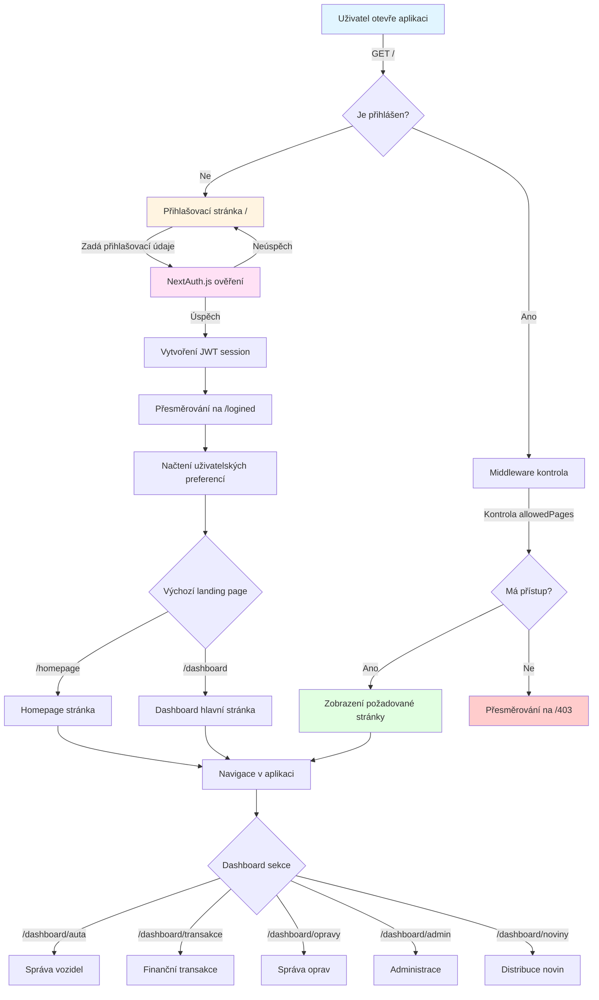

# App Router Dokumentace

## Úvod

Složka `src/app/` obsahuje kompletní strukturu Next.js App Router, která definuje routing, stránky, API endpointy a server actions aplikace. App Router je nový routing systém Next.js 14, který využívá React Server Components pro optimalizaci výkonu a zlepšení uživatelského zážitku.

## Struktura Routingu

Next.js App Router používá file-based routing, kde struktura složek přímo odpovídá URL struktuře aplikace. Každá složka může obsahovat soubor `page.tsx` (nebo `page.ts`), který definuje stránku, a `layout.tsx` pro sdílené layouty.

### Route Groups

Route Groups jsou složky uzavřené v závorkách `(název)`, které **neovlivňují URL strukturu**, ale umožňují organizaci kódu a sdílení layoutů.

**Příklad: `(dashboard)`**
- Složka `(dashboard)` je route group, která seskupuje související stránky
- URL zůstává stejná jako bez závorek (např. `/dashboard/auta`)
- Umožňuje sdílet společný layout pro všechny dashboard stránky

### Hlavní routing struktura

```
src/app/
├── page.tsx                    # Kořenová stránka (/)
├── layout.tsx                   # Root layout pro celou aplikaci
├── homepage/                    # Homepage stránka (/homepage)
│   └── page.tsx
├── dashboard/                   # Dashboard sekce (/dashboard)
│   ├── layout.tsx              # Layout specifický pro dashboard
│   ├── page.tsx                # Dashboard hlavní stránka
│   ├── auta/                   # Správa vozidel (/dashboard/auta)
│   ├── transakce/              # Finanční transakce
│   ├── opravy/                 # Správa oprav
│   ├── admin/                  # Administrační sekce
│   └── noviny/                 # Distribuce novin
├── logined/                     # Přesměrování po přihlášení
│   └── page.tsx
└── reset-password/             # Resetování hesla
    └── page.tsx
```

## Autentizace a Ochrana Cest

### Middleware

Autentizace a autorizace jsou řešeny pomocí Next.js middleware (`src/middleware.ts`), který se spouští před každým požadavkem. Middleware:

1. **Ověřuje autentizaci** - Kontroluje přítomnost validního JWT tokenu
2. **Kontroluje oprávnění** - Ověřuje, zda má uživatel přístup k požadované stránce
3. **Přesměrovává** - Nepřihlášení uživatelé jsou přesměrováni na přihlašovací stránku
4. **Enforcuje allowedPages** - Kontroluje, zda je stránka v seznamu povolených stránek pro roli uživatele

### NextAuth.js Integrace

Autentizace je implementována pomocí NextAuth.js 4:

- **Provider**: Credentials Provider (přihlášení pomocí e-mailu/username a hesla)
- **Session Strategy**: JWT (JSON Web Tokens)
- **Session Duration**: 30 dní
- **Callbacks**: 
  - `jwt` - Přidává uživatelské role a oprávnění do tokenu
  - `session` - Rozšiřuje session objekt o uživatelské informace

### Ochrana stránek

Stránky jsou chráněny na několika úrovních:

1. **Middleware úroveň** - Automatická kontrola pro všechny `/dashboard` a `/homepage` routy
2. **Komponenta úroveň** - Použití `useSession()` hooku pro kontrolu v komponentách
3. **Server Action úroveň** - Ověřování oprávnění před provedením akcí

### Role-based Access Control

Systém podporuje pokročilý systém rolí:
- **ADMIN** - Plný přístup ke všem funkcím
- **DRIVER** - Přístup k řidičským funkcím
- **USER** - Základní uživatelské oprávnění
- **Custom Roles** - Dynamicky definované role s vlastními oprávněními

Každá role má:
- `allowedPages` - Seznam povolených stránek
- `defaultLandingPage` - Výchozí stránka po přihlášení
- `permissions` - Granulární oprávnění pro specifické akce

## Mapování Složek

### `/api` - API Routes

API Routes poskytují RESTful endpointy pro komunikaci s frontendem:

- **`/api/auth/[...nextauth]`** - NextAuth.js endpointy pro autentizaci
- **`/api/auta/`** - CRUD operace pro vozidla
  - `GET /api/auta` - Seznam všech vozidel
  - `GET /api/auta/[id]` - Detail vozidla
  - `POST /api/auta` - Vytvoření nového vozidla
  - `PUT /api/auta/[id]` - Aktualizace vozidla
  - `DELETE /api/auta/[id]` - Smazání vozidla
- **`/api/transakce/`** - Finanční transakce
- **`/api/admin/`** - Administrační endpointy (vyžaduje ADMIN roli)
  - `/api/admin/users` - Správa uživatelů
  - `/api/admin/roles` - Správa rolí
  - `/api/admin/settings` - Systémová nastavení
- **`/api/gps/receive`** - Příjem GPS dat z externích zařízení
- **`/api/driver-login/`** - Endpointy pro řidičské přihlášení

### `/actions` - Server Actions

Server Actions jsou server-side funkce, které mohou být volány přímo z React komponent:

- **`repairs.ts`** - Server actions pro správu oprav vozidel

Server Actions poskytují:
- Type-safe komunikaci mezi klientem a serverem
- Automatickou serializaci dat
- Integraci s React formami
- Optimalizaci síťových požadavků

### `/logined` - Přesměrování po přihlášení

Stránka `/logined` slouží jako mezilehlá stránka pro přesměrování uživatele na jeho výchozí landing page po úspěšném přihlášení. Zohledňuje:
- Uživatelské preference (`defaultLandingPage`)
- Role-based default landing page
- Předchozí URL (pokud existuje)

### `/newspaper` - Distribuce Novin

Sekce pro správu distribuce novin obsahuje:

- **`/newspaper/admin/`** - Administrační rozhraní pro distribuci
- **`/newspaper/drivers/`** - Správa řidičů
- **`/newspaper/routes/`** - Plánování tras
- **`/newspaper/planning/`** - Plánování distribuce
- **`/newspaper/statistics/`** - Statistiky distribuce
- **`/newspaper/vehicles/`** - Přiřazení vozidel k trasám

## Navigační Flow

Níže je znázorněn tok navigace uživatele v aplikaci:



### Vysvětlení navigačního flow

1. **Vstupní bod** - Uživatel otevře aplikaci na kořenové URL
2. **Autentizace** - Middleware kontroluje přihlášení
3. **Přesměrování** - Nepřihlášení uživatelé jdou na přihlašovací stránku
4. **Ověření** - NextAuth.js ověřuje přihlašovací údaje
5. **Session vytvoření** - Po úspěšném přihlášení se vytvoří JWT session
6. **Landing page** - Uživatel je přesměrován na výchozí stránku podle role/preferencí
7. **Autorizace** - Middleware kontroluje oprávnění pro každou stránku
8. **Navigace** - Uživatel může navigovat mezi sekcemi podle svých oprávnění

## Best Practices

### Organizace kódu

1. **Route Groups** - Používejte route groups `(název)` pro logické seskupení stránek bez ovlivnění URL
2. **Layouts** - Využívejte `layout.tsx` pro sdílené UI elementy (např. navigace, sidebar)
3. **Loading States** - Vytvářejte `loading.tsx` soubory pro zobrazení loading stavů
4. **Error Handling** - Používejte `error.tsx` pro error boundaries
5. **Metadata** - Exportujte `metadata` objekt pro SEO optimalizaci

### Výkon

1. **Server Components** - Používejte Server Components jako výchozí (nejsou potřeba 'use client')
2. **Client Components** - Používejte pouze tam, kde je potřeba interaktivita (hooks, event handlers)
3. **Data Fetching** - Fetchujte data přímo v Server Components, ne v useEffect
4. **Streaming** - Využívejte React Suspense pro progressive rendering

### Bezpečnost

1. **Middleware** - Vždy chraňte citlivé routy v middleware
2. **Server Actions** - Ověřujte oprávnění v každé Server Action
3. **API Routes** - Validujte vstupy a kontrolujte oprávnění v API routes
4. **Environment Variables** - Nikdy neexponujte citlivé proměnné na klienta

## Související dokumentace

- [Root README](../README.md) - Obecná dokumentace projektu
- [Databázová dokumentace](../../prisma/README.md) - Prisma schema a modely
- [Komponenty dokumentace](../components/README.md) - React komponenty
- [Utility knihovny](../lib/README.md) - Pomocné funkce

