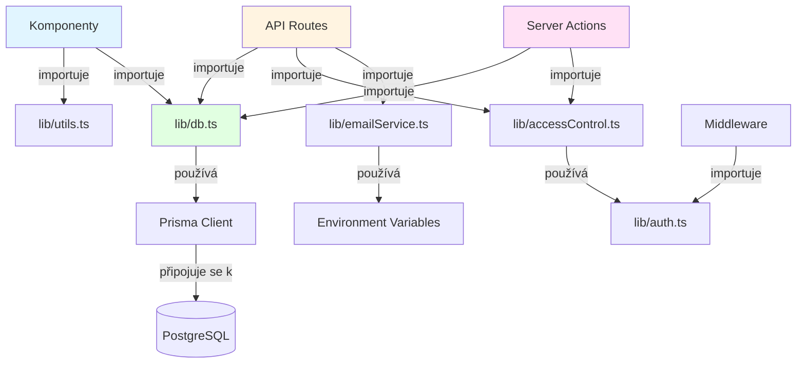

# Utility a Knihovny Dokumentace

## Úvod

Složka `src/lib/` obsahuje pomocné funkce, utility a sdílenou logiku aplikace. Oddělení této logiky do samostatné složky zajišťuje lepší organizaci kódu, znovupoužitelnost a testovatelnost. Tyto moduly jsou importovány napříč celou aplikací a poskytují konzistentní API pro běžné operace.

## Účel Oddělení Logiky

Oddělení utility funkcí a knihoven do `src/lib/` přináší následující výhody:

1. **Znovupoužitelnost** - Funkce mohou být použity v různých částech aplikace
2. **Testovatelnost** - Utility funkce jsou snadno testovatelné izolovaně
3. **Údržba** - Centralizovaná logika usnadňuje údržbu a refaktoring
4. **Type Safety** - TypeScript typy zajišťují bezpečné použití
5. **Organizace** - Jasná struktura usnadňuje orientaci v kódu

## Klíčové Moduly

### `db.ts` - Prisma Client Instance

Poskytuje singleton instanci Prisma Client pro přístup k databázi.

**Účel:**
- Zajišťuje jedinou instanci Prisma Client v aplikaci
- Prevence vytváření více instancí během hot reloading ve vývoji
- Optimalizace připojení k databázi

**Použití:**
```typescript
import { db } from "@/lib/db"

// Dotaz na databázi
const vehicles = await db.auto.findMany()

// Vytvoření záznamu
const newVehicle = await db.auto.create({
  data: {
    spz: "ABC-1234",
    znacka: "Škoda",
    model: "Octavia",
    // ...
  }
})
```

**Důležité poznámky:**
- V produkci se vytváří nová instance při každém serverless requestu
- Ve vývoji se instance ukládá do globálního objektu pro hot reloading
- Vždy používejte `db` místo vytváření nové instance `PrismaClient`

### `prisma.ts` - Alternativní Prisma Export

Alternativní export Prisma Client instance (kompatibilita se starším kódem).

**Použití:**
```typescript
import { prisma } from "@/lib/prisma"
// Ekvivalentní s importem z db.ts
```

### `utils.ts` - Obecné Utility Funkce

Obsahuje obecné pomocné funkce pro práci s třídami CSS a další utility.

**Hlavní funkce:**

#### `cn(...inputs: ClassValue[])`
Kombinuje CSS třídy pomocí `clsx` a `tailwind-merge`. Řeší konflikty mezi Tailwind třídami.

```typescript
import { cn } from "@/lib/utils"

// Základní použití
<div className={cn("base-class", "another-class")} />

// S podmínkami
<div className={cn(
  "base-class",
  isActive && "active-class",
  isDisabled && "disabled-class"
)} />

// S přepsáním z props
<div className={cn("base-class", className)} />
```

**Výhody:**
- Automatické řešení konfliktů Tailwind tříd (např. `p-4` přepíše `p-2`)
- Podpora podmíněných tříd
- Type-safe kombinování

### `auth.ts` - Autentizační Konfigurace

Obsahuje NextAuth konfiguraci a pomocné funkce pro autentizaci.

**Hlavní exporty:**
- `authOptions` - NextAuth konfigurační objekt
- `ROLE_PERMISSIONS` - Mapování rolí na oprávnění
- Autentizační callback funkce

**Použití:**
```typescript
import { authOptions } from "@/lib/auth"
import NextAuth from "next-auth"

export default NextAuth(authOptions)
```

**Role a oprávnění:**
- Definuje mapování mezi rolemi a jejich oprávněními
- Používá se v `accessControl.ts` pro kontrolu přístupu

### `accessControl.ts` - Kontrola Přístupu

Poskytuje utility funkce pro kontrolu rolí a oprávnění uživatelů.

**Hlavní funkce:**

#### `hasRole(user, role: string): boolean`
Kontroluje, zda má uživatel specifickou roli.

```typescript
import { hasRole } from "@/lib/accessControl"

if (hasRole(session.user, "ADMIN")) {
  // Uživatel je administrátor
}
```

#### `hasPermission(user, permission: string): boolean`
Kontroluje, zda má uživatel specifické oprávnění (přímo nebo přes roli).

```typescript
import { hasPermission } from "@/lib/accessControl"

if (hasPermission(session.user, "view_vehicles")) {
  // Uživatel má oprávnění zobrazit vozidla
}
```

#### `hasAnyPermission(user, permissions: string[]): boolean`
Kontroluje, zda má uživatel alespoň jedno z daných oprávnění.

```typescript
import { hasAnyPermission } from "@/lib/accessControl"

if (hasAnyPermission(session.user, ["edit_vehicles", "delete_vehicles"])) {
  // Uživatel má alespoň jedno z oprávnění
}
```

**Použití v API Routes:**
```typescript
import { getServerSession } from "next-auth"
import { hasPermission } from "@/lib/accessControl"
import { authOptions } from "@/lib/auth"

export async function GET(request: Request) {
  const session = await getServerSession(authOptions)
  
  if (!hasPermission(session?.user, "view_vehicles")) {
    return NextResponse.json(
      { error: "Forbidden" },
      { status: 403 }
    )
  }
  
  // Pokračování v logice
}
```

### `emailService.ts` - E-mailový Servis

Poskytuje funkce pro odesílání e-mailů pomocí Nodemailer.

**Hlavní funkce:**
- `sendEmail()` - Odeslání e-mailu
- `sendPasswordResetEmail()` - Odeslání e-mailu pro resetování hesla
- Konfigurace SMTP připojení

**Použití:**
```typescript
import { sendPasswordResetEmail } from "@/lib/emailService"

await sendPasswordResetEmail(user.email, resetToken)
```

**Konfigurace:**
Vyžaduje následující environment proměnné:
- `SMTP_HOST` - SMTP server
- `SMTP_PORT` - SMTP port
- `SMTP_USER` - SMTP uživatelské jméno
- `SMTP_PASSWORD` - SMTP heslo
- `SMTP_FROM` - E-mailová adresa odesílatele

### `imageUtils.ts` - Utility pro Práci s Obrázky

Poskytuje funkce pro zpracování a manipulaci s obrázky.

**Hlavní funkce:**
- Konverze obrázků do Base64
- Validace MIME typů
- Optimalizace obrázků
- Generování thumbnailů

**Použití:**
```typescript
import { processImage, validateImageType } from "@/lib/imageUtils"

const base64Image = await processImage(imageFile)
const isValid = validateImageType(imageFile.type)
```

### `create-user.ts` - Vytváření Uživatelů

Utility funkce pro vytváření nových uživatelů s hashováním hesel.

**Hlavní funkce:**
- `createUser()` - Vytvoření nového uživatele s hashovaným heslem
- Validace vstupních dat
- Automatické přiřazení výchozích rolí

**Použití:**
```typescript
import { createUser } from "@/lib/create-user"

const user = await createUser({
  email: "user@example.com",
  password: "securePassword123",
  name: "Jan Novák",
  role: "USER"
})
```

### `dynamicPermissions.ts` - Dynamická Oprávnění

Systém pro dynamické kontroly oprávnění založený na databázových rolích.

**Funkce:**
- Načítání oprávnění z databáze
- Dynamické kontroly přístupu
- Integrace s role-based access control

### `data.ts` - Mock Data a Testovací Data

Obsahuje mock data pro vývoj a testování.

**Použití:**
- Vývoj bez připojení k databázi
- Testování UI komponent
- Demo data pro prezentace

### `mock-data.ts` - Alternativní Mock Data

Alternativní zdroj mock dat pro specifické use cases.

## Organizace a Best Practices

### 1. Importování

Vždy používejte absolutní cesty s `@/` aliasem:

```typescript
// ✅ Dobře
import { cn } from "@/lib/utils"
import { db } from "@/lib/db"

// ❌ Špatně
import { cn } from "../../lib/utils"
```

### 2. Type Safety

Všechny utility funkce by měly mít TypeScript typy:

```typescript
export function hasPermission(
  user: UserLike | null | undefined,
  permission: string
): boolean {
  // Implementace
}
```

### 3. Error Handling

Utility funkce by měly správně zpracovávat chyby:

```typescript
export async function sendEmail(to: string, subject: string, body: string) {
  try {
    // Odeslání e-mailu
  } catch (error) {
    console.error("Failed to send email:", error)
    throw new Error("Email sending failed")
  }
}
```

### 4. Dokumentace

Důležité funkce by měly mít JSDoc komentáře:

```typescript
/**
 * Kontroluje, zda má uživatel specifické oprávnění.
 * 
 * @param user - Uživatelský objekt s role a permissions
 * @param permission - Název oprávnění k ověření
 * @returns true pokud má uživatel oprávnění, jinak false
 */
export function hasPermission(
  user: UserLike | null | undefined,
  permission: string
): boolean {
  // Implementace
}
```

### 5. Testování

Utility funkce by měly být pokryty unit testy:

```typescript
// __tests__/utils.test.ts
import { cn } from "@/lib/utils"

describe("cn", () => {
  it("should combine classes", () => {
    expect(cn("class1", "class2")).toBe("class1 class2")
  })
  
  it("should handle conditional classes", () => {
    expect(cn("base", true && "conditional")).toBe("base conditional")
  })
})
```

## Vztahy Mezi Moduly



## Přidávání Nových Utility Funkcí

Při přidávání nových utility funkcí:

1. **Umístění** - Vytvořte nový soubor v `src/lib/` nebo přidejte do existujícího
2. **Název souboru** - Používejte kebab-case (např. `image-utils.ts`)
3. **Export** - Exportujte funkce jako named exports
4. **Typy** - Definujte TypeScript typy pro všechny parametry a návratové hodnoty
5. **Dokumentace** - Přidejte JSDoc komentáře pro důležité funkce
6. **Testy** - Vytvořte unit testy pro nové funkce

**Příklad:**
```typescript
// src/lib/date-utils.ts

/**
 * Formátuje datum do českého formátu.
 * 
 * @param date - Datum k formátování
 * @returns Formátované datum jako string
 */
export function formatDateCZ(date: Date): string {
  return new Intl.DateTimeFormat("cs-CZ", {
    day: "2-digit",
    month: "2-digit",
    year: "numeric"
  }).format(date)
}
```

## Související dokumentace

- [Root README](../../README.md) - Obecná dokumentace projektu
- [App Router dokumentace](../app/README.md) - Použití utility v routách
- [Komponenty dokumentace](../components/README.md) - Použití utility v komponentách
- [Databázová dokumentace](../../prisma/README.md) - Prisma a databáze

